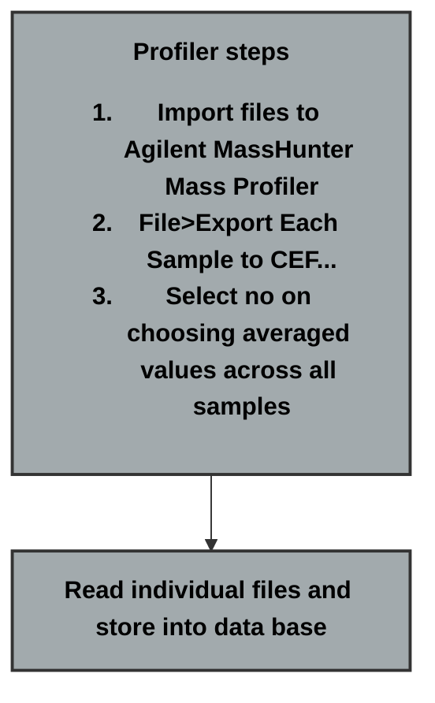

# Reading in XML files workflow

```mermaid
graph TD
    A[Profiler steps<br><ol><li>Import files to Agilent MassHunter Mass Profiler</li><li>File>Export Each Sample to CEF...</li><li>Select no on choosing averaged values across all samples</li></ol>] --> B[Read individual files and store into data base]


    style A fill:#A2AAAD,stroke:#333,stroke-width:2px,color:#000000,font-weight:bold
    style B fill:#A2AAAD,stroke:#333,stroke-width:2px,color:#000000,font-weight:bold

```